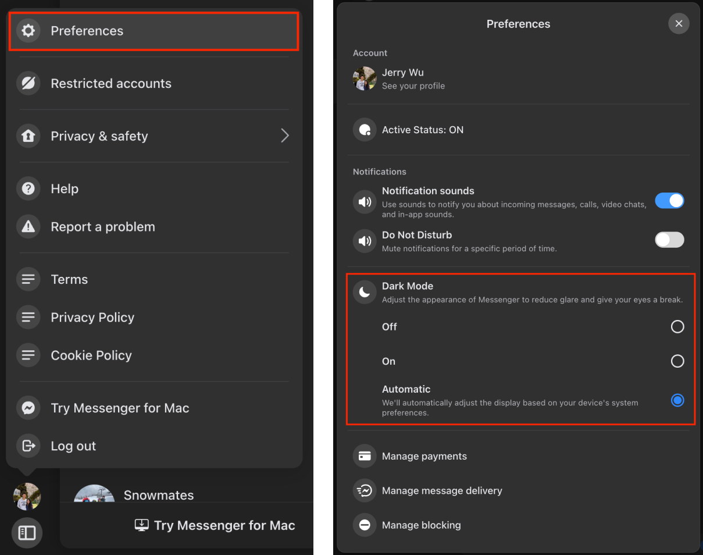
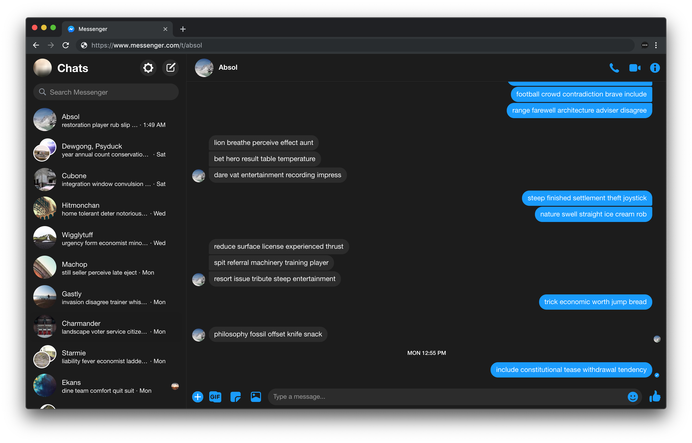

# messenger-dark-theme (deprecated)

In mid 2024, Facebook finally rolled out a native dark theme for messenger.com, making this extension unnecessary. I recommend uninstalling this and using the native version instead ([instructions here](#enabling-the-native-dark-theme)).

I'll leave this up until the end of July but will unpublish it from the chrome & edge stores afterwards.

## Enabling the native dark theme

You can enable the native dark theme via the preferences in the bottom left menu.

## Previous README

A simple dark theme for Facebook Messenger.

Get it from the [Chrome Web Store](https://chrome.google.com/webstore/detail/messenger-dark-theme/eobhfnijalkolbbmdoonheekjidkoojd) or the [Edge Web Store](https://microsoftedge.microsoft.com/addons/detail/messenger-dark-theme/nbmdlnmnhmjmaeokcnnkfeilhfhggnbo).

